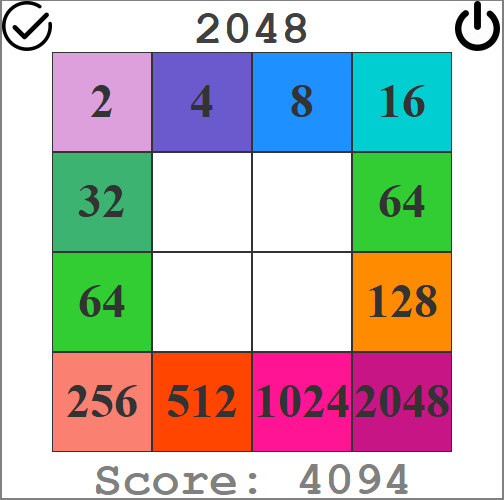

# 2048
***2048*** is a single-player sliding tile puzzle video game.

## HOW TO PLAY:
Use your  **arrow keys** to move the tiles. Tiles with the same number **merge into one** when they touch. Add them up to reach **2048!**  
Or you could ask the **AI** to solve the game 😉 by clicking the ✔ on the top-left corner 🎉

## Development:
The game clone is developed using **Java (Swing)**. And the AI for this game is developed using **mini-max algorithm** with **alpha-beta pruning**.

## Download:
*You can download the game from here: [**2048**](https://github.com/AMB-19/Game2048/raw/master/target/2048.jar)*

**Pre-Requisites:** In order to run this game you need to have Java Runtime Environment (JRE) [[download]](https://www.java.com/download/ie_manual.jsp) installed on your computer.

## In-Game Screenshot:

  
```
 💡 If you want to contribute to this project
    and make it better with new ideas,
    then your PR is very much welcomed! ✨ 
```
